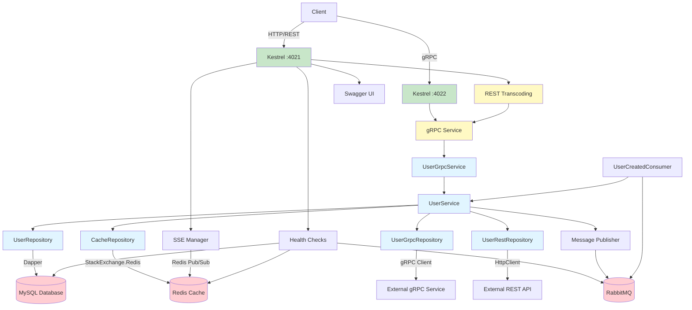

# Skeleton API .NET

**skeleton-api-net** adalah template project untuk membangun microservice berbasis .NET 10 dengan arsitektur yang scalable, maintainable, dan production-ready. Template ini menyediakan fondasi yang solid dengan berbagai fitur enterprise-grade yang siap digunakan.

## 🚀 Fitur Utama

### 🏗️ Arsitektur & Desain
- **Clean Architecture** - Pemisahan layer yang jelas (Domain, Application, Infrastructure, Presentation)
- **Dependency Injection** - Built-in Microsoft.Extensions.DependencyInjection
- **Interface-based Design** - Memudahkan testing dan maintainability
- **Repository Pattern** - Abstraksi akses data
- **Code Generator CLI** - Tool otomatisasi untuk scaffolding project, entity, client, dan MQ. Mendukung input **OpenAPI (YAML/JSON)**, Proto, dan **Multi-Table SQL Schema** (menghasilkan project lengkap dengan banyak entitas sekaligus). Redis cache repository disertakan secara default.

### 🌐 API & Komunikasi
- **Dual Protocol Support**
  - **gRPC** dengan JSON Transcoding untuk REST API otomatis
  - **HTTP/REST** endpoints dari proto definitions
  - **HTTPS/TLS** support dengan sertifikat PEM dan PFX
- **Standardized REST Response Format** - Consistent success/error/paginated responses
- **Protocol Buffers** - Schema definition dan code generation
- **Swagger/OpenAPI** - Dokumentasi API interaktif di `/swagger/`
- **gRPC Reflection** - Service discovery untuk development
- **Server-Sent Events (SSE)** - Real-time updates dengan Redis Pub/Sub untuk multi-pod scaling

### 💾 Database & Caching
- **Multi-Database Support** - Support untuk **MySQL**, **PostgreSQL**, dan **SQL Server**
- **Dapper** - High-performance micro-ORM untuk native SQL queries
- **Redis** - Caching dan message broker untuk SSE
- **Database Migrations** - Menggunakan golang-migrate
- **Connection Pool Management** - Built-in connection pooling

### 📨 Message Broker (Multi-Provider)
Support untuk 3 message broker dengan interface yang sama:
- **RabbitMQ** - Default, production-ready
  - Dead Letter Queue (DLQ) support
  - **Delayed Message Exchange** - x-delayed-message plugin
  - **Automatic retry** dengan exponential backoff (2s, 4s, 8s)
  - Max 3 retries sebelum DLQ
- **Google Cloud Pub/Sub** - Cloud-native messaging
- **Apache Kafka** - High-throughput streaming
- **Consumer Management** - Graceful shutdown dan error handling

### ☁️ Google Cloud Pub/Sub Emulator
Untuk development lokal tanpa koneksi ke GCP, Anda bisa menggunakan Pub/Sub Emulator.

**Cara Install & Menjalankan:**
1. Jalankan script setup:
   ```bash
   ./setup-dependencies.sh
   ```
2. Pilih opsi instalasi Pub/Sub Emulator.
3. Set environment variable:
   ```bash
   export PUBSUB_EMULATOR_HOST=localhost:8085
   ```
4. Jalankan aplikasi. Aplikasi akan otomatis mendeteksi emulator jika env var tersebut diset.

### 🎯 Resilience & Reliability
- **Circuit Breaker** - Menggunakan Polly untuk HTTP dan gRPC clients
- **Retry Mechanism** - Configurable retry dengan exponential backoff
- **Timeout Management** - Per-request dan global timeouts
- **Graceful Shutdown** - Proper cleanup untuk semua resources (180s termination grace period)

### 🔍 Observability
- **Structured Logging** - Serilog dengan JSON/Console format
- **Elastic APM Integration** - Distributed tracing dan performance monitoring
  - HTTP request tracing
  - gRPC request tracing
  - Database query tracing
  - Message broker tracing
  - Custom transaction tracking
- **Health Check Endpoints** - `/health`, `/health/live`, `/health/ready` untuk Kubernetes probes
- **Diagnostic Server** - Production-ready diagnostics untuk performance analysis
  - Memory dumps
  - GC stats
  - Thread dumps
  - Runtime on/off via configuration
  - Multi-pod Kubernetes support

### 🎚️ Feature Flags
Support untuk multiple feature flag providers dengan **local memory caching**:
- **Flipt** - Self-hosted feature flag management
- **Go Feature Flag** - File-based atau remote configuration
- **OpenFeature SDK** - Vendor-agnostic interface
- **Local Memory Cache** - 80-90% latency reduction dengan IMemoryCache
- **Periodic Refresh** - Background service untuk sync dari Flipt
- **Graceful Fallback** - Tetap berjalan meskipun Flipt down
- **Prometheus Metrics** - Monitoring cache performance
- **Manual Invalidation** - API endpoints untuk cache management

### 🔒 Security & Validation
- **JWT Claims with ExtraAttributes** - [Documentation](docs/claims_extra_attributes.md)
- **Input Validation** - FluentValidation untuk business rules
- **TLS/HTTPS Support** - Certificate management (PEM & PFX)
- **Secure Configuration** - Environment-based secrets
- **Non-root Docker User** - Security best practice

### 🐳 Deployment & DevOps
- **Docker Support** - Multi-stage build dengan Alpine base
- **Kubernetes Ready**
  - Deployment manifests (GCP & Huawei Cloud)
  - Service definitions
  - HorizontalPodAutoscaler (HPA) - 2-10 replicas
  - Zero-downtime deployment
  - Init containers untuk TLS certificate generation (keytool)
  - Liveness & Readiness probes
- **CI/CD Pipeline**
  - Jenkins pipeline configuration
  - Automated testing
  - SonarQube integration
  - Multi-environment deployment (dev/staging/prod)
  - Slack notifications
- **Scripts**
  - `build.sh` - Build dan push Docker image
  - `deploy.sh` - Deploy ke Kubernetes
  - `setup-dependencies.sh` - Setup Docker dependencies (MySQL, Redis, RabbitMQ, Elastic, Flipt, Pub/Sub Emulator)
  - `Makefile` - 19 targets untuk development workflow

### 🧪 Testing
- **xUnit** - Unit testing framework
- **Moq** - Mocking library
- **Test Coverage** - Built-in coverage tools
- **Integration Tests** - gRPC dan HTTP endpoint testing

## 📋 Prerequisites

- **.NET SDK** 10.0 atau lebih tinggi
- **Database** (pilih salah satu):
  - MySQL 5.7+ atau 8.0+
  - PostgreSQL 13+
  - SQL Server 2019+
- **Redis** 6.0+
- **Message Broker** (pilih salah satu):
  - RabbitMQ 3.8+ (dengan delayed message plugin)
  - Google Cloud Pub/Sub
  - Apache Kafka 2.8+

### Development Tools (Optional)
- **Docker** & Docker Compose
- **Kubernetes** (kubectl)
- **golang-migrate** - Database migrations
- **grpcurl** - Testing gRPC endpoints
- **Make** - Build automation tool

## 🪟 Windows Usage Guide

Untuk pengguna Windows, sangat disarankan menggunakan salah satu metode berikut agar pengalaman development tetap *smooth*:

### 1. WSL2 (Windows Subsystem for Linux) - **Sangat Disarankan**
Gunakan WSL2 (Ubuntu 22.04+) untuk menjalankan semua perintah `make` dan script shell.
- **Setup**: Install Ubuntu dari Microsoft Store.
- **VS Code**: Gunakan ekstensi **Remote - WSL** untuk membuka folder project di dalam WSL.
- **Git**: Jalankan `git config --global core.autocrlf input` di Windows agar *line endings* tidak berubah menjadi CRLF.

### 2. DevContainer (Zero Setup)
Jika Anda menggunakan VS Code dan Docker Desktop, Anda bisa langsung membuka project ini di dalam kontainer:
- Klik tombol **"Remote Window"** (ikon hijau di pojok kiri bawah) atau buka Command Palette (`Ctrl+Shift+P`).
- Pilih **"Dev Containers: Reopen in Container"**.
- Semua *dependencies* (.NET SDK, Make) sudah terpasang otomatis di dalam kontainer.

### 3. Docker Desktop
Pastikan Docker Desktop menggunakan **WSL2 Backend** untuk performa terbaik.

## 🛠️ Installation

### 1. Clone Repository
```bash
git clone <repository-url>
cd skeleton-api-net
```

### 2. Restore Dependencies
```bash
dotnet restore
```

### 3. Setup Docker Dependencies (Recommended)
```bash
# Interactive setup untuk MySQL, Redis, RabbitMQ, Elastic Stack, dan Flipt
make setup-deps
```

Script ini akan:
- ✅ Mendeteksi services yang sudah running
- ✅ Menawarkan instalasi untuk services yang belum ada
- ✅ Menggunakan default credentials yang sudah dikonfigurasi
- ✅ Membuat containers dengan nama `skeleton-*`
- ✅ Build custom RabbitMQ image dengan delayed message plugin

### 4. Setup Configuration
```bash
# Configuration sudah tersedia di appsettings.json
# Edit jika diperlukan
nano src/SkeletonApi/appsettings.json
```

### 5. Setup Database
```bash
# Install migration tool
make install-migrate

# Set database password (sesuai dengan Docker setup, default: @b15m1ll4h)
export DATABASE_PASSWORD=@b15m1ll4h

# Run migrations
make migrate-up
```

### 6. Code Generator CLI
 
Template ini dilengkapi dengan tool generator untuk mempercepat proses development melalui otomatisasi scaffolding. Tool ini mendukung **Incremental Updates** (menambah method baru tanpa merusak code lama) dan **Selective Generation** (hanya memperbarui layer tertentu).

**Build Generator:**
```bash
make build-generator
```
Binary akan dihasilkan di `tools/generator/bin/SkeletonApi.Generator`.

**Available Commands:**

| Command | Description | Example |
|---------|-------------|---------|
| `project` | Generate complete new API project | `./bin/generator project --input api.yaml --type openapi --name MyApi --output ./MyApi` |
| `entity` | Add entity to existing project | `./bin/generator entity --input product.json --type json --output .` |
| `client` | Generate external service client (gRPC/REST) | `./bin/generator client --input payment.yaml --type openapi --name PaymentService --output .` |
| `mq` | Generate MQ publisher | `./bin/generator mq --input mq_publisher.json --output .` |
| `consumer` | Add MQ consumer to existing project | `./bin/generator consumer --input mq_subscriber.json --output .` |
| `new-consumer` | **Generate standalone consumer project** | `./bin/generator new-consumer --name OrderConsumer --input mq_subscriber.json --output ..` |

**Key Features:**
- ✅ **Multiple Input Formats**: Proto, JSON, **SQL Schema (Single/Multi-table)**
- ✅ **Standardized Pagination**: Built-in `GetAllPaginated` support across all layers (Proto, Service, Repo)- ✅ **Incremental Updates**: Add methods without breaking existing code
- ✅ **Selective Generation**: Update only specific layers (Domain, Mappers, Contracts)
- ✅ **Redis Cache**: Automatically generated and wired by default
- ✅ **Profiling Support**: DiagnosticServer auto-configured
- ✅ **Clean Architecture**: Proper layer separation (Domain, Application, Infrastructure)

**Example: Generate Standalone Consumer Project**
```bash
# Create a dedicated consumer service
./bin/generator new-consumer \
  --name OrderConsumer \
  --input examples/mq_subscriber.json \
  --output ..

# Result: Complete Worker Service project at ../OrderConsumer/
# - src/OrderConsumer/ (Main project with consumers)
# - src/OrderConsumer.Application/ (Business logic)
# - src/OrderConsumer.Domain/ (Domain entities)
# - src/OrderConsumer.Infrastructure/ (Data access)
# - src/OrderConsumer.Common/ (Shared utilities)
# - tools/HealthCheck/ (Health check tool)
# - Makefile, Dockerfile, Kubernetes manifests, etc.
```

Lihat dokumentasi skenario lengkap di [GENERATOR_SCENARIOS.md](docs/GENERATOR_SCENARIOS.md).

## 📦 Remote Package Support (NuGet)

Generator ini mendukung dua mode referensi untuk logic `Common`:

1.  **Local (Default)**: Logic `Common` disalin sebagai source code lokal ke dalam project baru.
2.  **Remote**: Project baru akan menambahkan referensi NuGet ke package `Common`. Cocok untuk tim yang ingin berbagi logic standar tanpa menduplikasi kode.

### Cara Generate dengan Remote Package
```bash
make gen-remote ARGS="--name MyProject --output ../MyProject"
```
*Target ini akan otomatis mengambil versi terbaru dari `SkeletonApi.Common.csproj`.*

### Workflow Update SkeletonApi.Common

Jika Anda menggunakan distribusi **Otomatis via GitLab CI/CD**, ikuti langkah mudah ini:

1.  **Modify**: Lakukan perubahan kode di folder `src/SkeletonApi.Common`.
2.  **Bump Version**: Jalankan `make bump-common` (penting! agar tidak conflict versi).
3.  **Push**: Commit dan push ke repository.
    ```bash
    git add .
    git commit -m "update common logic to v1.0.x"
    git push origin master
    ```
4.  **Wait**: GitLab CI pipeline (`.gitlab-ci.yml`) akan otomatis mendeteksi perubahan, mem-pack, dan mem-publish package baru ke Registry.
5.  **Consume**: Team lain tinggal menjalankan `dotnet add package SkeletonApi.Common -v 1.0.x` (sesuai versi baru).

### Cara Update Versi Common pada Project yang Sudah Ada
Jika Anda sudah memiliki project yang digenerate dan ingin mengupdate versi `Common` package-nya, ada 3 cara:

#### A. Cara Otomatis (Menggunakan Generator)
Jalankan perintah generate dengan flag `--update`. Generator akan men-scan semua file `.csproj` dan mengupdate versinya tanpa merusak perubahan kode Anda.
```bash
make gen-remote ARGS="--input path/to/schema.proto --output ../ExistingProject --name ExistingProject --update"
```

#### B. Cara CLI (Standard .NET)
Jalankan perintah ini di dalam folder project target untuk setiap project yang membutuhkan:
```bash
dotnet add package SkeletonApi.Common -v 1.0.x
```

#### C. Cara Manual
Buka file `.csproj` (seperti `ProjectName.csproj`, `ProjectName.Application.csproj`, dll) dan ubah versi pada bagian `PackageReference`:
```xml
<PackageReference Include="SkeletonApi.Common" Version="1.0.x" />
```
<PackageReference Include="SkeletonApi.Common" Version="1.0.x" />
```
Jangan lupa jalankan `dotnet restore` setelahnya.

### 🏢 Private Package Registry (GitLab)

Jika tim Anda menggunakan GitLab Package Registry untuk mendistribusikan `SkeletonApi.Common` (tidak copy-paste file manual), ikuti langkah berikut:

#### 1. Publisher (Anda / CI/CD)
**Recommended**: Gunakan GitLab CI/CD (sudah terkonfigurasi di `.gitlab-ci.yml`). Cukup push perubahan kode ke repository, dan pipeline akan otomatis mem-build & publish package baru.

**Manual (Local)**:
Jika ingin publish manual dari laptop lokal:
```bash
# Butuh Personal Access Token (scope: api atau write_registry)
make publish-common GITLAB_TOKEN=glpat-xxxxxxxxxxxx
```
Perintah ini akan:
1. Bump version (patch).
2. Pack menjadi `.nupkg`.
3. Push ke Registry `git.bluebird.id`.

#### 2. Consumer (Team Member)
Agar bisa `dotnet add package` dari private registry, setiap developer harus memiliki file `nuget.config`.

1. Copy file `nuget.config.template` menjadi `nuget.config`.
2. Isi credential GitLab Anda:
   ```xml
   <add key="Username" value="username_anda" />
   <add key="ClearTextPassword" value="glpat-xxxxxxxx" />
   ```
3. Jalankan perintah add package seperti biasa:
   ```bash
   dotnet add package SkeletonApi.Common -v 1.0.x
   ```

## ⚙️ Configuration

File konfigurasi utama: `src/SkeletonApi/appsettings.json`

### Environment Variable Overrides
Semua konfigurasi di dalam `appsettings.json` dapat di-override menggunakan Environment Variables.

**Aturan Penulisan:**
- Gunakan **HURUF KAPITAL** atau **PascalCase**.
- Ganti pemisah titik `.` atau nested object `json` dengan **double underscore `__`**.

**Contoh:**
| Config di JSON | Environment Variable |
|----------------|----------------------|
| `Server:HttpPort` | `Server__HttpPort` |
| `Database:Host` | `Database__Host` |
| `MessageBroker:RabbitMQ:Host` | `MessageBroker__RabbitMQ__Host` |

**Overriding Arrays (List):**
Gunakan index angka untuk mengakses elemen array:
- `MessageBroker__Kafka__Brokers__0=broker1:9092`
- `MessageBroker__Kafka__Brokers__1=broker2:9092`

### Server Configuration
```json
{
  "Server": {
    "HttpPort": 4021,      // REST API port
    "GrpcPort": 4022,      // gRPC port
    "HttpsPort": 4023,     // HTTPS port
    "CertFile": "cert.pem",
    "KeyFile": "key.pem"
  }
}
```

### Database Configuration
```json
{
  "Database": {
    "Host": "localhost",
    "Port": 3307,
    "Database": "skeleton",
    "User": "root",
    "Password": "@b15m1ll4h",
    "Provider": "mysql", // Options: mysql, postgresql, sqlserver
    "MaxOpenConnections": 25,
    "MaxIdleConnections": 5
  }
}
```

### Cache (Redis) Configuration
```json
{
  "Cache": {
    "Host": "localhost",
    "Port": 6379,
    "Database": 2,
    "User": "default",
    "Password": ""
  }
}
```

### Message Broker Configuration
```json
{
  "MessageBroker": {
    "ClientId": 3,  // 1=Kafka, 2=PubSub, 3=RabbitMQ
    "RabbitMQ": {
      "Host": "localhost",
      "Port": 5672,
      "Username": "guest",
      "Password": "guest",
      "MessageTtl": 2,
      "QueueExpiration": 3,
      "EnableDlq": true,
      "Topics": {
        "TopicAction": "user.created"
      },
      "Subscriptions": {
        "TopicAction": "user.created"
      }
    }
  }
}
```

### Feature Flag Configuration

```json
{
  "FeatureFlag": {
    "Provider": "flipt",  // Options: "flipt", "go-feature-flag"
    "Host": "http://localhost:8080",
    "Path": "config/flags.yaml",
    
    // Cache configuration (NEW)
    "Cache": {
      "Enabled": true,              // Enable local memory cache
      "TtlSeconds": 60,              // Cache entry TTL
      "RefreshSeconds": 30,          // Background refresh interval
      "WarmupFlags": [               // Flags to preload on startup
        "grpc-client",
        "new-user-processing",
        "maintenance-mode"
      ],
      "MetricsEnabled": true         // Enable Prometheus metrics
    }
  }
}
```

**Feature Flag Caching Benefits:**
- ✅ **80-90% latency reduction** - Cache hit ~7ms vs ~50-100ms Flipt call
- ✅ **97% less Flipt load** - Only cache misses + periodic refresh hit Flipt
- ✅ **Graceful degradation** - Works even when Flipt is down (uses cached/default values)
- ✅ **Observable** - Prometheus metrics for cache hits/misses/errors
- ✅ **Manageable** - API endpoints for cache invalidation

**Cache Behavior:**
1. **First request** → Fetch from Flipt → Store in cache → Return value
2. **Subsequent requests** → Return from cache (if not expired)
3. **Background refresh** → Every 30s, refresh expired entries from Flipt
4. **Flipt down** → Use cached values, or default values if cache empty
5. **Manual invalidation** → Clear cache via API endpoints

### Observability Configuration
```json
{
  "ElasticApm": {
    "Enabled": false,
    "ServerUrl": "http://localhost:8200",
    "ServiceName": "skeleton-api-net",
    "ServiceVersion": "1.0.0",
    "Environment": "development",
    "TransactionSampleRate": 1.0,
    "CaptureBody": "all",
    "CaptureHeaders": true
  }
}
```

### Profiling Configuration
```json
{
  "Profiling": {
    "Enabled": false,
    "Port": 6060,
    "Host": "localhost"
  }
}
```

## 🚀 Running the Application

### Development Mode
```bash
# Run directly
make run

# Or using dotnet
dotnet run --project src/SkeletonApi/SkeletonApi.csproj

# Or with hot reload
dotnet watch --project src/SkeletonApi/SkeletonApi.csproj
```

### Production Mode
```bash
# Build
make build

# Run
dotnet src/SkeletonApi/bin/Release/net10.0/SkeletonApi.dll
```

### Using Docker
```bash
# Build image
make docker-build

# Run container
make docker-run

# Or manually
docker run -p 4021:4021 -p 4022:4022 -p 4023:4023 \
  -v $(pwd)/appsettings.json:/app/appsettings.json \
  skeleton-api-net:latest
```

## 📡 API Endpoints

### Health Check
```bash
curl http://localhost:4021/health
curl http://localhost:4021/health/live
curl http://localhost:4021/health/ready
```

### Swagger UI
Buka browser: `http://localhost:4021/swagger/`

### REST API Examples

#### Create User
```bash
curl -X POST http://localhost:4021/v1/user \
  -H "Content-Type: application/json" \
  -d '{
    "username": "johndoe",
    "email": "john@example.com",
    "password": "secret123",
    "full_name": "John Doe",
    "role": "user"
  }'
```

#### Get All Users
```bash
curl http://localhost:4021/v1/user
```

#### Get User by ID
```bash
curl http://localhost:4021/v1/user/{user_id}
```

#### Update User
```bash
curl -X PUT http://localhost:4021/v1/user/{user-id} \
  -H "Content-Type: application/json" \
  -d '{
    "full_name": "John Doe Updated",
    "is_active": true
  }'
```

#### Delete User
```bash
curl -X DELETE http://localhost:4021/v1/user/{user-id}
```

#### Search Users
```bash
curl -X POST http://localhost:4021/v1/user/search \
  -H "Content-Type: application/json" \
  -d '{"query": "john"}'
```

#### Get All Users Paginated
```bash
# Default pagination (page=1, page_size=10)
curl http://localhost:4021/v1/users/paginated

# Custom pagination
curl "http://localhost:4021/v1/users/paginated?page=2&page_size=20"

# Response format
{
  "success": true,
  "message": "Success",
  "data": {
    "items": [
      {
        "id": "uuid",
        "username": "johndoe",
        "email": "john@example.com",
        ...
      }
    ],
    "pagination": {
      "page": 2,
      "page_size": 20,
      "total_items": 100,
      "total_pages": 5
    }
  },
  "timestamp": "2025-12-04T13:00:00Z"
}
```

### gRPC Examples

#### Using grpcurl
```bash
# List services
grpcurl -plaintext localhost:4022 list

# List methods
grpcurl -plaintext localhost:4022 list proto.UserGrpcService

# Call GetAll
grpcurl -plaintext localhost:4022 proto.UserGrpcService/GetAll

# Call GetById
grpcurl -plaintext -d '{"id": "user-id"}' \
  localhost:4022 proto.UserGrpcService/GetById
```

### Server-Sent Events (SSE)

#### Stream Real-time User Updates
```bash
# Connect to SSE stream
curl -N http://localhost:4021/api/v1/users/stream
```

### Feature Flags API

Aplikasi ini menyediakan API endpoints untuk mengelola feature flags dengan **local memory caching** untuk performa optimal.

#### Get All Feature Flags

```bash
curl http://localhost:4021/api/v1/feature-flags
```

**Response:**
```json
{
  "success": true,
  "data": {
    "grpc-client": false,
    "new-user-processing": true,
    "maintenance-mode": false,
    "api-version": "v1",
    "max-concurrent-requests": 10
  }
}
```

#### Get Cache Statistics

```bash
curl http://localhost:4021/api/v1/feature-flags/stats
```

**Response:**
```json
{
  "success": true,
  "data": {
    "enabled": true,
    "total_entries": 8,
    "active_entries": 8,
    "expired_entries": 0,
    "ttl_seconds": 60
  }
}
```

#### Invalidate All Cache

```bash
curl -X POST http://localhost:4021/api/v1/feature-flags/cache/invalidate
```

**Response:**
```json
{
  "success": true,
  "data": {
    "message": "Cache invalidated successfully"
  }
}
```

#### Invalidate Specific Flag

```bash
curl -X POST "http://localhost:4021/api/v1/feature-flags/cache/invalidate-flag?flag=grpc-client"
```

**Response:**
```json
{
  "success": true,
  "data": {
    "message": "Flag invalidated successfully",
    "flag": "grpc-client"
  }
}
```

#### Performance Comparison

**Without Cache:**
```bash
# First call - fetches from Flipt
time curl http://localhost:4021/api/v1/feature-flags
# real: 0m0.050s (50ms)

# Second call - still fetches from Flipt
time curl http://localhost:4021/api/v1/feature-flags
# real: 0m0.052s (52ms)
```

**With Cache (Enabled):**
```bash
# First call - cache miss, fetches from Flipt
time curl http://localhost:4021/api/v1/feature-flags
# real: 0m0.050s (50ms)

# Second call - cache hit, returns from memory
time curl http://localhost:4021/api/v1/feature-flags
# real: 0m0.007s (7ms) ⚡ 85% faster!
```

#### Prometheus Metrics

Feature flag cache metrics tersedia di `/metrics` endpoint:

```bash
curl http://localhost:4021/metrics | grep feature_flag
```

**Available Metrics:**
- `feature_flag_cache_hits_total` - Total cache hits
- `feature_flag_cache_misses_total` - Total cache misses  
- `feature_flag_cache_errors_total` - Total errors fetching from Flipt
- `feature_flag_cache_size` - Current number of cached entries
- `feature_flag_cache_ttl_seconds` - Configured TTL

**Example Prometheus Queries:**

```promql
# Cache hit rate
rate(feature_flag_cache_hits_total[5m]) / 
(rate(feature_flag_cache_hits_total[5m]) + rate(feature_flag_cache_misses_total[5m]))

# Cache error rate
rate(feature_flag_cache_errors_total[5m])

# Average cache size
avg_over_time(feature_flag_cache_size[5m])
```


## 📊 APM Distributed Tracing

Aplikasi ini terintegrasi dengan **Elastic APM** untuk distributed tracing dan performance monitoring.

### Sample Flow: Create User with Trace ID

```bash
curl -X POST http://localhost:4021/v1/user \
  -H "Content-Type: application/json" \
  -d '{"username":"johndoe","email":"john@example.com","password":"secret123","full_name":"John Doe","role":"user"}'
```

**Trace Flow:**
```
1. HTTP Request → POST /proto.UserGrpcService/Add (21ms)
   ├─ 2. Database → INSERT INTO users (18ms)
   ├─ 3. Redis → SET user:id (683μs)
   └─ 4. Messaging → publish_user_created (1.6ms)
       └─ Headers: traceparent, trace.id, transaction.id

5. Consumer → consume user.created
   ├─ Labels: parent_trace_id (linked to step 1)
   └─ 6. Business Logic → process_user_created
```

**View in Kibana APM:**
1. Open: `http://localhost:5601`
2. Navigate: **Observability → APM → Services → skeleton-api-net**
3. Click transaction: `POST /proto.UserGrpcService/Add`
4. See timeline with database, redis, and messaging spans
5. Find consumer in **Metadata** → Labels → `parent_trace_id`

## 🔬 Diagnostics Server

Aplikasi ini dilengkapi dengan **Diagnostic Server** untuk production-ready performance analysis.

### Konfigurasi

Enable diagnostics di `appsettings.json`:

```json
{
  "Profiling": {
    "Enabled": true,
    "Port": 6060,
    "Host": "localhost"
  }
}
```

### Local Development

**1. Akses Diagnostic Endpoints:**
```bash
# Memory dump
curl http://localhost:6060/debug/diagnostics/dump

# GC stats
curl http://localhost:6060/debug/diagnostics/gc

# Thread dump
curl http://localhost:6060/debug/diagnostics/threads
```

**2. Collect Diagnostics:**
```bash
# Using dotnet-dump
dotnet-dump collect -p <PID>

# Using dotnet-trace
dotnet-trace collect -p <PID> --duration 00:00:30
```

### Multi-Pod Kubernetes Access

**1. List pods:**
```bash
kubectl get pods -l app=skeleton-api-net
```

**2. Port-forward ke pod spesifik:**
```bash
kubectl port-forward pod/POD_NAME 6060:6060
```

**3. Collect diagnostics:**
```bash
curl http://localhost:6060/debug/diagnostics/dump > pod-dump.dmp
```

## 🧪 Testing

### Run All Tests
```bash
make test
```

### Run Tests with Coverage
```bash
make test-coverage
```

### Run Specific Tests
```bash
# Specific project
dotnet test tests/SkeletonApi.Tests/SkeletonApi.Tests.csproj

# Specific test
dotnet test --filter "FullyQualifiedName~UserServiceTests"
```

## 📦 Project Structure

```
skeleton-api-net/
├── src/
│   ├── SkeletonApi/                    # Main API project
│   │   ├── Program.cs                  # Application entry point
│   │   ├── Protos/                     # Protocol buffer definitions
│   │   ├── Services/                   # gRPC service implementations
│   │   ├── Extensions/                 # DI extensions
│   │   └── appsettings.json            # Configuration
│   ├── SkeletonApi.Domain/             # Domain layer
│   │   └── Entities/                   # Domain entities
│   ├── SkeletonApi.Application/        # Application layer
│   │   ├── Interfaces/                 # Service interfaces
│   │   ├── Services/                   # Business logic
│   │   └── Validators/                 # Input validation
│   ├── SkeletonApi.Infrastructure/     # Infrastructure layer
│   │   ├── Repositories/               # Data access (Dapper)
│   │   ├── Cache/                      # Redis caching
│   │   ├── Grpc/                       # gRPC clients
│   │   ├── Http/                       # HTTP clients
│   │   └── SSE/                        # Server-Sent Events
│   └── SkeletonApi.Common/             # Shared utilities
│       ├── Messaging/                  # Message broker clients
│       │   ├── RabbitMQ/              # RabbitMQ with delayed exchange
│       │   ├── Kafka/                 # Kafka client
│       │   └── PubSub/                # Google Pub/Sub client
│       ├── Configuration/              # Options classes
│       └── Middleware/                 # Custom middleware
├── migrations/                          # Database migrations
│   ├── 000001_create_users_table.up.sql
│   └── 000001_create_users_table.down.sql
├── deployments/                         # Kubernetes manifests
│   ├── service.yaml                    # Service + Deployment + HPA
│   ├── gcp/                            # GCP-specific configs
│   └── huawei/                         # Huawei Cloud configs
├── tests/                               # Unit & integration tests
├── docs/                                # Documentation
│   └── ARCHITECTURE-REVIEW.md          # Architecture review (9.3/10)
├── Dockerfile                           # Multi-stage Docker build
├── Dockerfile.rabbitmq                  # Custom RabbitMQ with delayed plugin
├── Jenkinsfile                          # CI/CD pipeline
├── build.sh                             # Build script
├── deploy.sh                            # Deployment script
├── setup-dependencies.sh                # Dependencies setup
├── Makefile                             # Development commands (19 targets)
├── sonar-project.properties             # SonarQube config
└── skeleton-api-net.sln                # Solution file
```

## 🏗️ Architecture Patterns

## 🤖 AI-Driven Development Workflow (Specs)

Project ini didesain untuk dikembangkan menggunakan AI Assistant dengan workflow **Specs**. AI harus mengikuti tahapan berikut:

### 1. Requirements (EARS Notation)
Gunakan notasi **EARS** untuk definisikan requirement yang terstruktur (terutama untuk **Specs-Driven Development**):
- **Ubiquitous**: The <system name> shall <system response>.
- **Event-driven**: WHEN <trigger> THE <system name> shall <system response>.
- **State-driven**: WHILE <precondition> THE <system name> shall <system response>.
- **Unwanted Behavior**: IF <trigger> THEN THE <system name> shall <system response>.
- **Optional Feature**: WHERE <feature is included> THE <system name> shall <system response>.

### 2. Design & Tasks
AI akan membuat desain teknis dan memecah implementasi menjadi checklist (Domain -> Application -> Infrastructure -> Presentation).

Referensi lengkap: [docs/steering/specs.md](docs/steering/specs.md)

### System Architecture



### Clean Architecture Layers

1. **Domain Layer** (`SkeletonApi.Domain`)
   - Entities dan business objects
   - Tidak bergantung pada layer lain

2. **Application Layer** (`SkeletonApi.Application`)
   - Business logic dan use cases
   - Interfaces untuk repositories
   - Validators dan mappers

3. **Infrastructure Layer** (`SkeletonApi.Infrastructure`)
   - Data access implementations (Dapper)
   - External service integrations
   - Caching (Redis)
   - Message brokers
   - gRPC/HTTP clients

4. **Common Layer** (`SkeletonApi.Common`)
   - Shared utilities
   - Message broker abstractions
   - Middleware
   - Configuration

5. **Presentation Layer** (`SkeletonApi`)
   - gRPC services
   - HTTP/REST endpoints (via transcoding)
   - API configuration
   - Dependency injection setup

### Dependency Flow
```
Presentation → Application → Domain
     ↓              ↓
Infrastructure ← Application
     ↓
  Common
```

## 🔌 Technology Stack

| Component | Technology | Purpose |
|-----------|-----------|---------|
| Framework | .NET 10.0 | Application framework |
| API | gRPC + JSON Transcoding | Dual protocol support |
| Database ORM | Dapper | High-performance SQL queries |
| Caching | StackExchange.Redis | Distributed caching |
| Validation | FluentValidation | Input validation |
| Logging | Serilog | Structured logging |
| APM | Elastic.Apm.NetCoreAll | Distributed tracing |
| API Docs | Swashbuckle | OpenAPI/Swagger |
| Testing | xUnit + Moq | Unit testing |
| Resilience | Polly | Circuit breaker & retry |
| Feature Flags | OpenFeature | Feature management |
| Message Broker | RabbitMQ.Client / Kafka / Pub/Sub | Async messaging |

## 📚 Makefile Commands

```bash
# Development
make run                # Run application
make dev                # Run with hot reload
make build              # Build release binary
make clean              # Clean build artifacts
make bump-common        # Increment patch version in SkeletonApi.Common
make pack-common        # Bump version and pack SkeletonApi.Common

# Testing
make test               # Run all tests
make test-coverage      # Run tests with coverage
make test-report        # Generate coverage report

# Database
make install-migrate    # Install golang-migrate
make migrate-up         # Run migrations
make migrate-down       # Rollback migrations
make migrate-create     # Create new migration

# Docker
make docker-build       # Build Docker image
make docker-run         # Run Docker container
make docker-push        # Push to registry

# Dependencies
make setup-deps         # Setup Docker dependencies

# Code Quality
make lint               # Run linter
make format             # Format code

# Generator
make build-generator    # Build project generator
make gen ARGS="..."     # Run generator with custom args
make gen-remote ARGS="..." # Run generator using latest Common NuGet

# Deployment
make deploy-dev         # Deploy to development
make deploy-staging     # Deploy to staging
make deploy-prod        # Deploy to production
```

## 🚢 Deployment

### Kubernetes Deployment

```bash
# Build and push image
./build.sh 1.0.0 gcr.io/your-project

# Deploy to Kubernetes
./deploy.sh development 1.0.0

# Or using Makefile
make deploy-dev VERSION=1.0.0
```

### CI/CD Pipeline

Pipeline stages:
1. **Checkout** - Clone repository
2. **Restore** - Restore NuGet packages
3. **Build** - Build solution
4. **Test** - Run unit tests
5. **Code Review** - SonarQube analysis
6. **Docker Login** - Authenticate to registry
7. **Deploy** - Deploy to environment (dev/staging/prod)
8. **Slack Notification** - Send build status

## 🤖 AI Prompting Instructions

Gunakan instruksi berikut saat meminta AI untuk membuat microservice baru menggunakan template ini sebagai referensi.

### 1. Context Setting
Berikan context ini di awal percakapan dengan AI:
> "Saya ingin membuat microservice baru menggunakan .NET 10 dengan Clean Architecture. Gunakan project `skeleton-api-net` sebagai referensi struktur folder, naming convention, dan library stack (Serilog, Dapper, FluentValidation, Redis, RabbitMQ, Elastic APM). Pastikan kode yang di-generate mengikuti SOLID principles dan DRY."

### 2. Project Generation Prompts

**Opsi A: Full Microservice (API + Consumer)**
> "Buatkan struktur project microservice baru bernama `[NamaService]` yang lengkap dengan fitur API (gRPC + REST) dan Message Consumer (RabbitMQ). Generate file-file dasar seperti `Program.cs`, `appsettings.json`, `Makefile`, dan `Dockerfile` mengikuti standar `skeleton-api-net`."

**Opsi B: API Only**
> "Buatkan struktur project microservice baru bernama `[NamaService]` yang HANYA fokus pada API (gRPC + REST). Jangan sertakan logic untuk Message Consumer. Setup server HTTP dan gRPC saja."

**Opsi C: Consumer Only**
> "Buatkan struktur project microservice baru bernama `[NamaService]` yang HANYA berfungsi sebagai Message Consumer (Worker). Jangan sertakan logic untuk HTTP/gRPC Server. Fokus pada consumption message dari RabbitMQ."

### 3. Code Generation Prompts

**Based on Proto:**
> "Saya memiliki file proto berikut:
> ```protobuf
> [paste content proto disini]
> ```
> Tolong generate kode untuk semua layer (Domain, Application/Services, Infrastructure/Repositories, gRPC Services) berdasarkan definisi proto tersebut. Pastikan mapping dari Proto ke Domain model dibuatkan dengan extension methods."

**Based on Table Schema:**
> "Saya memiliki skema tabel database berikut:
> ```sql
> [paste create table syntax disini]
> ```
> Tolong generate kode lengkap (Domain Entity, Repository Interface, Repository Implementation dengan Dapper, Service, gRPC Service) yang merefleksikan tabel tersebut. Tambahkan FluentValidation dan data annotations yang sesuai."

**Based on PlantUML Diagram:**
> "Saya memiliki diagram PlantUML berikut yang menggambarkan arsitektur service:
> ```plantuml
> [paste PlantUML diagram disini]
> ```
> Tolong generate kode untuk semua komponen yang ada di diagram tersebut. Pastikan:
> 1. Semua entity/domain model dibuat sesuai dengan class diagram
> 2. Relasi antar entity (one-to-many, many-to-many) diimplementasikan dengan benar
> 3. Sequence diagram diikuti untuk implementasi flow di Service layer
> 4. Component diagram diikuti untuk struktur folder dan dependencies
> 5. Semua interface dan implementasi mengikuti Clean Architecture
> 
> Generate juga:
> - Proto file untuk API contract
> - Database migration script (golang-migrate format)
> - Unit tests dengan xUnit dan Moq
> - XML documentation comments"

**Modify Service Based on PlantUML:**
> "Saya ingin memodifikasi service yang sudah ada berdasarkan diagram PlantUML berikut:
> ```plantuml
> [paste PlantUML diagram disini]
> ```
> Tolong identifikasi perubahan yang diperlukan dengan membandingkan diagram dengan kode yang ada, lalu:
> 1. Tambahkan entity/model baru yang ada di diagram tapi belum ada di kode
> 2. Update relasi antar entity sesuai diagram
> 3. Tambahkan method/endpoint baru yang ada di sequence diagram
> 4. Refactor struktur jika ada perubahan di component diagram
> 5. Pastikan backward compatibility - jangan hapus kode yang masih digunakan
> 
> Berikan summary perubahan yang akan dilakukan sebelum generate kode."

### 4. Modification & Updates (Non-Destructive)

**Update based on Proto Change:**
> "Saya baru saja menambahkan rpc `[NamaMethodBaru]` di file proto. Tolong generate implementasi method baru tersebut di layer gRPC Service, Application Service, dan Repository tanpa mengubah atau menghapus kode yang sudah ada. Hanya tambahkan method yang kurang."

**Update based on Table Change:**
> "Saya menambahkan kolom `[NamaKolom]` di tabel database. Tolong update Entity class dan Dapper queries di Repository untuk mengakomodasi kolom baru ini. Pastikan logic yang sudah ada tidak rusak."

### 5. Adding Message Consumers

**Add New Consumer to Existing Service:**
> "Saya ingin menambahkan consumer baru untuk topic `[nama-topic]` di service yang sudah ada. Consumer ini akan memproses message dengan payload berikut:
> ```json
> {
>   \"field1\": \"value1\",
>   \"field2\": \"value2\"
> }
> ```
> Tolong generate:
> 1. Class untuk message payload di `Domain/`
> 2. Consumer implementation di `Consumers/[Nama]Consumer.cs` sebagai BackgroundService
> 3. Service method untuk business logic processing
> 4. Repository method jika perlu akses database
> 5. Registrasi consumer di `DependencyInjection.cs`
> 
> Pastikan consumer menggunakan APM tracing, error handling yang proper, dan logging terstruktur seperti consumer yang sudah ada."

**Add Consumer with Dead Letter Queue:**
> "Buatkan consumer untuk topic `[nama-topic]` dengan Dead Letter Queue (DLQ) handling menggunakan RabbitMQ."

**Add Consumer with Batch Processing:**
> "Buatkan consumer untuk topic `[nama-topic]` yang memproses message secara batch (misalnya 100 message per batch atau setiap 5 detik). Consumer harus bisa handle partial failure dalam batch dan retry hanya message yang gagal."

**Add Event-Driven Consumer Chain:**
> "Saya ingin membuat consumer chain:
> 1. Consumer A consume dari topic `user.created`
> 2. Setelah processing, publish event ke topic `user.validated`
> 3. Consumer B consume dari topic `user.validated`
> 4. Setelah processing, publish event ke topic `user.onboarded`
> 
> Tolong generate semua consumer dengan proper error handling dan APM distributed tracing antar consumer."

**Add Consumer for External API Integration:**
> "Buatkan consumer untuk topic `[nama-topic]` yang akan:
> 1. Consume message dari RabbitMQ
> 2. Call external REST API `[URL]` dengan payload dari message
> 3. Implement retry dengan Polly (exponential backoff)
> 4. Implement circuit breaker untuk external API
> 5. Log semua request/response untuk audit
> 
> Gunakan HttpClient dengan Polly policies yang sudah ada di skeleton."

**Add Consumer with Database Transaction:**
> "Buatkan consumer untuk topic `order.created` yang akan:
> 1. Consume message order
> 2. Insert ke tabel `orders`
> 3. Update stock di tabel `products`
> 4. Insert audit log ke tabel `order_history`
> 
> Semua operasi harus dalam 1 database transaction. Jika salah satu gagal, rollback semua dan nack message untuk retry."

**Add Consumer with Idempotency:**
> "Buatkan consumer untuk topic `[nama-topic]` dengan idempotency handling. Consumer harus:
> 1. Check apakah message dengan ID yang sama sudah pernah diproses (gunakan Redis)
> 2. Jika sudah pernah diproses, skip processing dan ack message
> 3. Jika belum, proses message dan simpan ID ke Redis dengan TTL 24 jam
> 
> Ini untuk mencegah duplicate processing jika message di-retry."

**Convert Existing Function to Consumer:**
> "Saya punya method `ProcessUserRegistration` di Service yang saat ini dipanggil synchronous dari HTTP handler. Tolong convert method ini menjadi asynchronous consumer yang consume dari topic `user.registration`. HTTP handler cukup publish message ke topic, lalu consumer yang akan proses."

## 🐛 Troubleshooting

### Build Issues
```bash
# Clean and rebuild
make clean
dotnet restore
dotnet build
```

### Proto Generation Issues
```bash
# Clean obj folder
rm -rf src/SkeletonApi/obj
dotnet build src/SkeletonApi/SkeletonApi.csproj
```

### Database Connection Issues
- Verify MySQL is running: `docker ps | grep mysql`
- Check credentials in appsettings.json
- Ensure database exists: `make migrate-up`
- Check network connectivity

### RabbitMQ Delayed Message Issues
- Verify custom RabbitMQ image is used: `docker ps | grep rabbitmq`
- Check plugin is enabled: `docker exec skeleton-rabbitmq rabbitmq-plugins list`
- Should see `[E*] rabbitmq_delayed_message_exchange`

## 📄 Documentation

- [Architecture Review](docs/ARCHITECTURE-REVIEW.md) - Comprehensive architecture analysis (Score: 9.3/10)
- [Feature Parity Review](docs/FEATURE-PARITY-REVIEW.md) - Comparison with skeleton-api-go (100% parity)

## 📊 Architecture Score

**Overall Score: 9.3/10** (Higher than skeleton-api-go: 9.2/10)

- Clean Architecture: 9.5/10
- SOLID Principles: 9.5/10
- DRY: 9.5/10
- Best Practices: 9.5/10
- Code Quality: 9.0/10

## 🎯 Feature Parity

**100% feature parity** dengan skeleton-api-go:
- ✅ All 80+ features implemented
- ✅ Same architecture patterns
- ✅ Same deployment strategy
- ✅ Same observability stack
- ✅ Enhanced with .NET platform advantages

## 📄 License

[Specify your license here]

## 👥 Authors

- **M Nahyan Zulfikar** - *Solution Architect* - [nahyan.zulfikar@gmail.com](mailto:nahyan.zulfikar@gmail.com)

## 🙏 Acknowledgments

- [gRPC for .NET](https://grpc.io/docs/languages/csharp/)
- [Dapper](https://github.com/DapperLib/Dapper)
- [Serilog](https://serilog.net/)
- [FluentValidation](https://fluentvalidation.net/)
- [StackExchange.Redis](https://stackexchange.github.io/StackExchange.Redis/)
- [Elastic APM .NET Agent](https://www.elastic.co/guide/en/apm/agent/dotnet/current/index.html)
- [Polly](https://github.com/App-vNext/Polly)
- [OpenFeature](https://openfeature.dev/)

---

**Happy Coding! 🚀**
